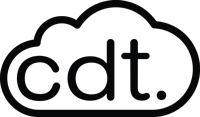

#  CDT.cloud Deployment-Server

## Introduction

The CDT.cloud Deployment-Server is a service for embedded deployment environments.
 
It enables the whole development process for microcontrollers, including distributed development, remote deployment and monitoring.
Additionally, the service allows for an overall administration of the devices and deployments with a user centric dashboard.

## Getting Started

We have implemented an auto-installation and start script [here](https://github.com/eclipsesource/cdtcloud-deploymentserver/blob/main/apps/main/main.sh) for a quick and easy start into the service.

For detailed instructions on how to start and adjust each service included in the CDT.cloud Deployment-Server please visit the individual packages.
- [Deployment Server](https://github.com/eclipsesource/cdtcloud-deploymentserver/tree/main/packages/deployment-server) by default running on [http://localhost:3001/api](http://localhost:3001/api) and the AdminUI on [http://localhost:3001](http://localhost:3001)
- [Theia Extension](https://github.com/eclipsesource/cdtcloud-deploymentserver/tree/main/packages/theia-extension) by default running on [http://localhost:3000](http://localhost:3000)
- [Device Connector](https://github.com/eclipsesource/cdtcloud-deploymentserver/tree/main/packages/device-connector)

### Quick Start

To have an easy installation and start of the CDT.cloud Services run the `./cdtcloud` script.

#### Requirements

- NodeJS Version >= 16.5.0
- Yarn Version >= 1.22.18
- PostgreSQL Server
- Arduino CLI >= 0.20.0

#### First Installation

1. Run a PostgreSQL Server -- Natively or using Docker (`docker-compose up db`)
2. Select *init* in the `./cdtcloud` script to run the initialization for the first start and install all dependencies

#### Starting a CDT.cloud Deployment-Server Service

- Using the `./cdtcloud` script, you can run a demo service by selecting *run cdtcloud demo*
- To start a specific service, use `yarn run` and select the desired command

#### Docker

1. Select *docker* in the `./cdtcloud` script
2. Enter the command to start the desired service
3. You can use the *docker* section to attach and kill containers as well

## Contributing

Any contribution is welcome!

- Developing directly to the project
- Testing PRs fixes
- Reporting bugs within the project
- Adding to or improving our wiki

## Authors & Contributors

- The original contributors from the project introduced at TUM -- [Gozzim](https://github.com/Gozzim), [WoH](https://github.com/WoH), [KevinK-9](https://github.com/KevinK-9), [theZasa](https://github.com/theZasa)
- [EclipseSource](https://eclipsesource.com/), specifically [Jonas Helming](https://github.com/JonasHelming) as Product Owner
- All [contributors](https://github.com/eclipsesource/cdtcloud-deploymentserver/graphs/contributors) of the project

## Important Links

- [Arduino CLI](https://github.com/arduino/arduino-cli)
- [Theia](https://theia-ide.org/)
- [EclipseSource](https://eclipsesource.com/)

## License

This code and content is released under the [EPL 2.0 license](https://github.com/eclipsesource/cdtcloud-deploymentserver/blob/main/LICENSE).
